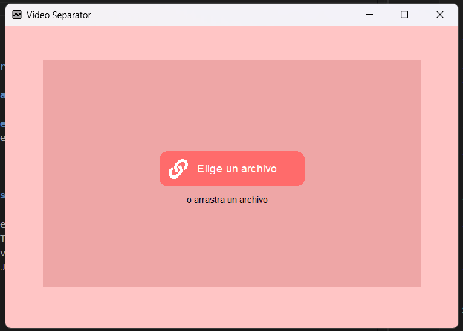

# Video and Audio Separator (In Progress)

This is a **Java application** that separates a video file into two components: its **audio track** and a **muted video**. The project is built using **JavaCV** and is still in development.



---

## Features 📋

- **Video Separation**: Extract the video stream from a file while muting the audio.
- **Audio Extraction**: Extract the audio stream and save it as a separate file.
- **JavaCV Integration**: Leverages the **JavaCV** library for handling multimedia file processing.

---

## Technologies Used ⚙️

- **Java**: The application is written in vanilla Java.
- **JavaCV**: The JavaCV library is used for handling video and audio extraction, leveraging FFmpeg for multimedia processing.
- **FFmpeg**: JavaCV uses FFmpeg under the hood to manage video and audio streams.

---

## Installation and Execution 🔧

1. Clone the repository or download the ZIP file:
    ```bash
    git clone https://github.com/yourusername/video-audio-separator.git
    ```
2. Navigate to the project directory:
    ```bash
    cd video-audio-separator
    ```
3. Install dependencies (ensure JavaCV is configured):
    - Include **JavaCV** dependencies in your project.
4. Compile the project:
    ```bash
    javac src/com/mediaseparator/*.java
    ```
5. Run the application:
    ```bash
    java src/com/mediaseparator/Main
    ```

---

## Project Structure 🔩

```
video-audio-separator/
├── src/
│     └── com/
│           └── mediaseparator/
│                 ├── Main.java               # Main class to launch the app
│                 ├── VideoProcessor.java     # Handles the video muting logic
│                 ├── AudioExtractor.java     # Extracts the audio from the video file
│                 └── example-video.mp4       # Sample video file for testing
└── README.md                                 # README file with project details
```

---

## Usage 🛠️

### 1. Video and Audio Separation

- Select a video file in the program.
- The application will extract the **audio** from the video and save it as a separate `.mp3` or `.wav` file.
- The video will be saved separately without audio (muted).

---

## Learning Objectives 🎓

- **Multimedia Handling in Java**: This project showcases how to work with video and audio streams using Java and JavaCV.
- **JavaCV and FFmpeg**: Learn how to leverage JavaCV and FFmpeg for manipulating video files programmatically.
  
---

## Known Issues 🐞

- **Large Video Files**: Performance may degrade with very large video files due to the complexity of processing.
- **Incomplete Functionality**: The project is still in progress, so features like format support or advanced audio handling are not yet fully implemented.

---

## Future Improvements 🚀

- **Support for More File Formats**: Expand support for different audio and video formats.
- **Progress Indicator**: Add a progress bar to show the extraction and conversion process.
- **Error Handling**: Implement more robust error handling for file input/output and unsupported formats.

---

## Special Thanks 🎁

Thanks to the JavaCV and FFmpeg communities for providing the tools and resources needed to understand multimedia processing.

---

Made by [Your Name] - mansourlol440@gmail.com